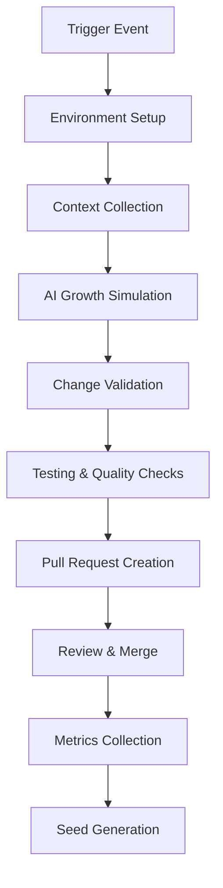

<!--
@file .github/workflows/README.md
@description GitHub Actions workflows documentation for AI Evolution Engine
@author AI Evolution Engine Team <team@ai-evolution-engine.org>
@created 2025-07-05
@lastModified 2025-07-12
@version 0.4.6

@relatedIssues
  - #workflow-optimization: Continuous improvement of CI/CD workflows
  - #evolution-automation: Automated evolution cycle management

@relatedEvolutions
  - v0.4.6: Cleaned workflow structure and optimized core evolution workflows
  - v0.4.1: Enhanced evolution workflow system with multiple growth modes
  - v0.3.6: Cross-platform compatibility and containerization support
  - v0.3.0: Enhanced workflow system with comprehensive standards and error handling

@dependencies
  - GitHub Actions: workflow execution platform
  - bash: >=4.0 for script execution
  - gh CLI: for workflow management and authentication

@changelog
  - 2025-11-09: Added branch strategy documentation - updated all workflows to use evolved/test branch structure - AEE
  - 2025-11-09: Consolidated documentation from shared-config.md, WORKFLOW_STANDARDS.md, IMPROVEMENTS_SUMMARY.md, and CLEANUP_SUMMARY.md into comprehensive README - AEE
  - 2025-07-12: Added comprehensive file header and enhanced documentation - AEE
  - 2025-07-05: Cleaned workflow structure and removed duplicate files - AEE
  - 2025-07-04: Enhanced workflow system with multiple growth modes - AEE
  - 2025-07-01: Initial creation of comprehensive workflow documentation - AEE

@usage Reference documentation for GitHub Actions workflows and CI/CD automation
@notes Contains consolidated documentation for core evolution workflows, standards, historical improvements, and branch strategy
-->

# AI Evolution Engine - GitHub Actions Workflows (v0.4.6)

This directory contains the GitHub Actions workflows that power the AI Evolution Engine, enabling automated and manual evolution of the codebase through AI-driven growth cycles.

## 🌿 Branch Strategy (Updated November 2025)

All workflows now use a dedicated branch structure for better isolation and review:

### Branch Structure

| Branch | Purpose | Updated By |
|--------|---------|------------|
| `main` | Stable production code | Manual merges from `evolved` |
| `evolved` | Evolution target & test source | Evolution workflow PRs |
| `evolved/evolution-*` | Individual evolution results | Evolution workflows |
| `test` | Consolidated test results | Test workflow PRs |
| `test/results-*` | Individual test runs | Test workflows |

### Quick Reference

| Workflow | Checkout Branch | Target Branch | Result Branch Pattern |
|----------|----------------|---------------|----------------------|
| `ai_evolver.yml` | `evolved` | `evolved` | `evolved/evolution-*` |
| `daily_evolution.yml` | `evolved` | `evolved` | via main workflow |
| `periodic_evolution.yml` | `evolved` | `evolved` | via main workflow |
| `testing_automation_evolver.yml` | `evolved` | `evolved` | via main workflow |
| `comprehensive_testing.yml` | `evolved` | `test` | `test/results-*` |

**See the [Branch Strategy](#-branch-strategy-details) section below for complete details.**

## 🧹 Cleaned Workflow Structure (v0.4.6)

As of v0.4.6, the workflow structure has been cleaned and optimized:

### ✅ Active Workflows
- `ai_evolver.yml` - Main manual evolution engine
- `daily_evolution.yml` - Automated daily maintenance
- `periodic_evolution.yml` - Scheduled periodic evolutions
- `testing_automation_evolver.yml` - Testing and build automation

### 🗑️ Removed Files
- `ai_evolver_fixed.yml` (duplicate - merged into main)
- `ai_evolver_v0.4.6.yml` (temporary - merged into main)

## 📋 Workflow Standards & Configuration

### Common Environment Variables

These should be used consistently across all workflows:

```yaml
env:
  EVOLUTION_VERSION: "0.4.6"
  WORKFLOW_TYPE: "descriptive_name"  # e.g., "manual_evolution", "scheduled_evolution", "testing_automation"
```

### Standard Permissions

All workflows should use these permissions:

```yaml
permissions:
  contents: write
  pull-requests: write
  issues: write
```

### Standard Checkout Configuration

Use this checkout configuration for consistency:

```yaml
- name: 🌱 Prepare Evolution Environment
  uses: actions/checkout@v4
  with:
    fetch-depth: 0
    token: ${{ secrets.GITHUB_TOKEN }}
```

### Common Input Parameters

#### Growth Modes

- `conservative`: Safe, minimal changes with thorough validation
- `adaptive`: Balanced approach with moderate changes and validation
- `experimental`: Advanced features and experimental changes
- `test-automation`: Focus on testing improvements and automation
- `build-optimization`: Focus on build and CI/CD improvements
- `error-resilience`: Focus on error handling and recovery patterns
- `ci-cd-enhancement`: Focus on CI/CD pipeline improvements

#### Evolution Types (for daily evolution)

- `consistency`: Fix inconsistencies across files and configurations
- `error_fixing`: Resolve errors, bugs, and issues
- `documentation`: Improve documentation quality and coverage
- `code_quality`: Enhance code quality, patterns, and standards
- `security_updates`: Apply security improvements and updates

#### Intensity Levels

- `minimal`: Small, safe changes with low risk
- `moderate`: Medium-sized improvements with moderate risk
- `comprehensive`: Large-scale improvements with higher impact

### Standard Environment Setup Pattern

All workflows should follow this pattern:

```yaml
- name: 🛠️ Setup Environment
  run: |
    if [ ! -f "./scripts/setup-environment.sh" ]; then
      echo "❌ Setup script not found!"
      exit 1
    fi
    chmod +x ./scripts/setup-environment.sh
    ./scripts/setup-environment.sh
```

### Script Execution Pattern

Always make scripts executable and include error handling:

```yaml
- name: 🧬 Script Name
  run: |
    chmod +x ./scripts/script-name.sh
    ./scripts/script-name.sh arg1 arg2
```

### Dry Run Support Pattern

Include dry run support in all evolution workflows:

```yaml
- name: 🔍 Dry Run - Preview Changes
  if: env.DRY_RUN == 'true'
  run: |
    echo "🔍 DRY RUN MODE - Changes that would be applied:"
    if [ -f "/tmp/evolution_response.json" ]; then
      cat "/tmp/evolution_response.json" | jq -r '.changes[] | "\(.type): \(.file)"' 2>/dev/null || echo "No changes preview available"
    fi
```

### Error Handling Standards

- Use `set -euo pipefail` for robust error handling in multi-line scripts
- Include validation steps before executing critical operations
- Provide meaningful error messages with actionable guidance
- Use conditional execution with proper if statements

### Naming Conventions

- **Step Names**: Use emojis for improved readability (🌱, 🛠️, 🧬, 🔍, etc.)
- **Job Names**: Use descriptive names that clearly indicate purpose
- **Variables**: Use UPPER_CASE for environment variables, lowercase for local variables
- **Files**: Use kebab-case for filenames and snake_case for script names

### File Path Standards

- **Temp Directory**: Use `/tmp/` for temporary files
- **Scripts**: Use relative paths `./scripts/` for script execution
- **Outputs**: Store workflow outputs in `/tmp/` for consistency
- **Configs**: Store configurations in predictable locations

### Required Input Parameters

All workflows should support these common inputs:

```yaml
inputs:
  dry_run:
    description: 'Run in simulation mode without making actual changes'
    required: false
    default: false
    type: boolean
```

### Token Usage

- Use `${{ secrets.GITHUB_TOKEN }}` instead of custom PAT tokens when possible
- Only use custom tokens when additional permissions are required
- Document any special token requirements in workflow comments

### Version Management

- Update version numbers consistently across all workflows
- Document breaking changes in workflow comments
- Maintain backward compatibility when possible

### Testing Standards

- Include validation steps in all workflows
- Test scripts independently before integration
- Provide meaningful output for debugging
- Include rollback procedures for critical operations

## 📈 Historical Improvements & Changes

### v0.3.0 Enhancement Summary

Comprehensive review and update of GitHub Actions workflows for consistency, simplicity, and improved maintainability following IT-Journey coding principles.

#### Key Improvements Made

##### 🔧 Consistency Enhancements
- **Unified naming conventions**: Consistent emoji usage and descriptive names
- **Environment variables**: Standardized across all workflows
- **Permission settings**: Consistent `contents: write`, `pull-requests: write`, `issues: write`
- **Token usage**: Migrated from `PAT_TOKEN` to standard `GITHUB_TOKEN` where possible

##### 🛡️ Error Handling & Reliability (DFF)
- **Robust Script Execution**: Enhanced validation before script execution
- **Enhanced Validation**: Added prerequisite validation steps with meaningful error messages
- **Proper conditional execution**: Safety checks and file existence validation

##### 🔄 Simplified Architecture (KIS)
- **Removed Complexity**: Eliminated redundant workflow patterns and unnecessary inline structures
- **Clear Separation of Concerns**: Distinct purposes for manual vs automated workflows
- **Consolidated common operations**: Reusable patterns across workflows

##### 📚 Documentation & Standards (COLAB)
- **Created Documentation Suite**: Comprehensive standards and pattern documentation
- **Standardized Patterns**: Consistent checkout, environment setup, and script execution
- **Inline comments**: Improved workflow step descriptions

##### 🚀 Enhanced Features
- **Dry Run Mode**: Safe testing capability for all workflows
- **Enhanced Logging**: Better visibility into workflow execution
- **Flexible Parameters**: More configuration options for different use cases
- **Health Monitoring**: Automated repository health assessment

#### Before vs. After Comparison

| Aspect | Before | After |
|--------|--------|--------|
| Version Management | Mixed versions | Unified (v0.3.0) |
| Token Usage | Mixed PAT_TOKEN/GITHUB_TOKEN | Standardized GITHUB_TOKEN |
| Error Handling | Basic script execution | Comprehensive validation |
| Dry Run Support | Missing in most workflows | Available in all workflows |
| Documentation | Minimal inline comments | Comprehensive docs + standards |

### v0.4.6 Cleanup Actions

#### Files Removed
- ❌ `ai_evolver_fixed.yml` - Temporary duplicate from fixing process
- ❌ `ai_evolver_v0.4.6.yml` - Temporary duplicate from fixing process

#### Files Retained and Updated
- ✅ `ai_evolver.yml` - **Main workflow** (v0.4.6)
- ✅ `daily_evolution.yml` - Daily automation (updated to v0.4.6)
- ✅ `periodic_evolution.yml` - Scheduled evolutions (updated to v0.4.6)
- ✅ `testing_automation_evolver.yml` - Testing automation (updated to v0.4.6)

#### Benefits of Cleanup
- **Reduced Confusion**: Eliminated duplicate workflow files with clear single source of truth
- **Improved Maintenance**: Consistent versioning and unified error handling approach
- **Enhanced Organization**: Logical separation of manual vs automated workflows

#### Current Workflow Structure
```text
.github/workflows/
├── ai_evolver.yml                    # 🌱 Main manual evolution engine
├── daily_evolution.yml              # 🕐 Daily automated maintenance
├── periodic_evolution.yml           # 🔄 Scheduled periodic evolutions
├── testing_automation_evolver.yml   # 🧪 Testing & build automation
├── README.md                        # 📖 Comprehensive documentation
├── WORKFLOW_STANDARDS.md            # 📋 Development standards
├── IMPROVEMENTS_SUMMARY.md          # 📈 Improvement tracking
└── shared-config.md                 # ⚙️ Shared configuration
```

### Impact Assessment

#### 🎯 Benefits Achieved
1. **Reliability**: Enhanced error handling reduces workflow failures
2. **Maintainability**: Consistent patterns make updates easier
3. **Usability**: Dry run mode enables safe testing
4. **Documentation**: Comprehensive guides improve onboarding
5. **Security**: Standardized token usage improves security posture

#### 🔍 Testing Recommendations
1. **Dry Run Testing**: Test all workflows with `dry_run=true`
2. **Error Scenarios**: Validate error handling with missing scripts
3. **Parameter Validation**: Test all input parameter combinations
4. **Token Permissions**: Verify GitHub token has sufficient permissions

## Workflow Overview

### 🌱 Core Evolution Workflows

#### 1. `ai_evolver.yml` - Manual Evolution Engine
**Purpose**: Primary workflow for manual AI-driven evolution triggered by human prompts

**Triggers**: 
- Manual dispatch with custom growth instructions

**Key Features**:
- Custom evolution prompts
- Multiple growth modes (conservative, adaptive, experimental)
- Dry run capability for safe testing
- Automatic seed planting for continuous evolution
- Pull request generation with detailed changes

**Usage**:
```bash
# Trigger manual evolution
gh workflow run ai_evolver.yml \
  -f prompt="Implement user authentication system" \
  -f growth_mode="adaptive" \
  -f dry_run=false
```

#### 2. `daily_evolution.yml` - Automated Maintenance
**Purpose**: Scheduled daily evolution for repository health and maintenance

**Triggers**:
- Daily at 3 AM UTC (scheduled)
- Manual dispatch for immediate health checks

**Key Features**:
- Repository health analysis
- Automatic issue detection and resolution
- Multiple evolution types (consistency, error_fixing, documentation, etc.)
- Intensity levels for controlled growth
- Smart evolution triggering (only when needed)

**Usage**:
```bash
# Force manual daily evolution
gh workflow run daily_evolution.yml \
  -f evolution_type="consistency" \
  -f intensity="moderate" \
  -f force_run=true
```

#### 3. `testing_automation_evolver.yml` - Testing & Build Optimization
**Purpose**: Specialized evolution focused on testing, build processes, and CI/CD improvements

**Triggers**:
- Manual dispatch for testing improvements

**Key Features**:
- Specialized growth modes for testing and builds
- Integration with zer0-mistakes error resolution patterns
- Configurable cycle and generation tracking
- Automated testing validation

**Usage**:
```bash
# Trigger testing evolution
gh workflow run testing_automation_evolver.yml \
  -f growth_mode="test-automation" \
  -f cycle="3" \
  -f generation="1"
```

## Evolution System Architecture

### 🧬 Growth Cycle Process

1. **Environment Preparation**: Setup repository and dependencies
2. **Context Collection**: Gather repository DNA and current state
3. **AI Growth Simulation**: Generate evolution strategy and changes
4. **Change Application**: Apply modifications to codebase
5. **Seed Planting**: Generate next evolution seeds
6. **Validation & Testing**: Ensure changes work correctly
7. **Pull Request Creation**: Submit changes for review

### 🌿 Growth Modes

| Mode | Description | Risk Level | Use Case |
|------|-------------|------------|----------|
| `conservative` | Safe, minimal changes | Low | Production systems, critical fixes |
| `adaptive` | Balanced improvements | Medium | General development, feature additions |
| `experimental` | Advanced features | High | Research, prototype development |
| `test-automation` | Testing focus | Low-Medium | Quality improvements |
| `build-optimization` | CI/CD focus | Medium | Performance improvements |
| `error-resilience` | Error handling | Low | Stability improvements |
| `ci-cd-enhancement` | Pipeline focus | Medium | DevOps improvements |

### 🔧 Supporting Scripts

All workflows utilize modular scripts in the `/scripts` directory:

- `setup-environment.sh`: Environment preparation and validation
- `collect-context.sh`: Repository analysis and context gathering
- `simulate-ai-growth.sh`: AI evolution simulation engine
- `apply-growth-changes.sh`: Change application and validation
- `plant-new-seeds.sh`: Next evolution seed generation
- `create_pr.sh`: Pull request creation and formatting
- `analyze-repository-health.sh`: Health assessment for daily evolution
- `test-evolved-seed.sh`: Evolution validation and testing

## Configuration Standards

All workflows follow consistent patterns defined in `WORKFLOW_STANDARDS.md`:

- **Permissions**: `contents: write`, `pull-requests: write`, `issues: write`
- **Token Usage**: Prefer `GITHUB_TOKEN` over custom PAT tokens
- **Error Handling**: Robust validation and meaningful error messages
- **Dry Run Support**: Safe testing mode for all evolution operations
- **Environment Variables**: Consistent naming and scoping
- **Script Execution**: Proper permissions and error handling

## Evolution Tracking

### Version Management
- Current system version: **v0.4.6**
- Version consistency across all workflows
- Enhanced compatibility and error handling
- Breaking change documentation

### Metrics Collection
- Evolution success rates
- Change impact analysis
- Repository health trends
- Performance metrics

## Security Considerations

### Token Management
- Use minimal required permissions
- Secure handling of sensitive data
- Audit trail for all changes

### Change Validation
- Mandatory dry run testing
- Pull request review process
- Automated validation checks
- Rollback procedures

## Troubleshooting

### Common Issues

1. **Script Not Found**: Ensure all scripts in `/scripts` directory are executable
2. **Permission Denied**: Check repository permissions and token scope
3. **Evolution Failed**: Review logs and use dry run mode for debugging
4. **Missing Dependencies**: Verify setup script execution

### Debug Mode
Enable verbose logging by setting environment variables in workflow dispatch:
```yaml
env:
  DEBUG: true
  VERBOSE: true
```

## Contributing

### Adding New Workflows
1. Follow patterns in `WORKFLOW_STANDARDS.md`
2. Include dry run support
3. Add comprehensive error handling
4. Update this README
5. Test thoroughly before merging

### Modifying Existing Workflows
1. Maintain backward compatibility
2. Update version numbers
3. Document breaking changes
4. Test all evolution modes

## Future Enhancements

- [ ] **Multi-repository evolution support**
- [ ] **Advanced AI model integration**
- [ ] **Real-time evolution monitoring**
- [ ] **Custom evolution templates**
- [ ] **Integration with external tools**
- [ ] **Performance optimization**
- [ ] **Enhanced security features**
- [ ] **Workflow Analytics Dashboard**: Real-time monitoring and metrics visualization
- [ ] **Smart Scheduling**: AI-powered workflow scheduling based on repository activity
- [ ] **Rollback Automation**: Automated rollback capabilities for failed evolution cycles
- [ ] **Cross-Repository Coordination**: Coordinated evolution across multiple repositories
- [ ] **Custom Validation Gates**: Configurable quality gates for evolution approval

## Workflow Examples

### Common Evolution Scenarios

**Feature Development:**
```bash
# Add new feature with comprehensive testing
gh workflow run ai_evolver.yml \
  -f prompt="Add user authentication with JWT tokens, including unit tests and documentation" \
  -f growth_mode="adaptive" \
  -f dry_run=false
```

**Bug Fixes:**
```bash
# Conservative bug fix approach
gh workflow run ai_evolver.yml \
  -f prompt="Fix memory leak in data processing module" \
  -f growth_mode="conservative" \
  -f dry_run=true
```

**Performance Optimization:**
```bash
# Experimental performance improvements
gh workflow run daily_evolution.yml \
  -f evolution_type="performance_optimization" \
  -f intensity="moderate" \
  -f force_run=true
```

### Advanced Workflow Management

**Workflow Status Monitoring:**
```bash
# Check workflow status
gh run list --workflow=ai_evolver.yml --limit=5

# View detailed workflow logs
gh run view <run-id> --log

# Download workflow artifacts
gh run download <run-id>
```

**Workflow Debugging:**
```bash
# Enable debug mode
gh workflow run ai_evolver.yml \
  -f prompt="Debug test failures" \
  -f growth_mode="conservative" \
  -f debug_mode=true
```

## Integration Points

### External System Integration

**Monitoring Systems:**
- **GitHub Actions**: Native integration with GitHub's workflow system
- **Slack/Teams**: Notification webhooks for evolution completion
- **Email Alerts**: Automated notifications for critical evolution events
- **External APIs**: Integration with project management and monitoring tools

**Quality Gates:**
- **Code Quality**: SonarQube, CodeClimate integration
- **Security Scanning**: Snyk, GitHub Security integration
- **Performance Testing**: Integration with performance monitoring tools
- **Compliance**: Automated compliance checking and reporting

## Workflow Architecture

### Evolution Workflow Lifecycle



### Workflow Dependencies

**Required Services:**
- GitHub Actions runner environment
- AI simulation engine
- Git version control system
- Pull request management
- Artifact storage system

**Optional Integrations:**
- Container runtime for isolated execution
- External AI services for enhanced capabilities
- Monitoring and alerting systems
- Quality gate integrations

## 🌿 Branch Strategy Details

### Overview

The AI Evolution Engine uses a dedicated branch structure to isolate evolution and testing workflows from the main codebase, providing better control, review processes, and safety.

### Branch Flow Diagram

```
┌─────────────────────────────────────────────────────────────┐
│                         main branch                          │
│                    (stable production)                       │
└──────────────────────────┬──────────────────────────────────┘
                           │
                           │ merge after review & testing
                           ↓
┌─────────────────────────────────────────────────────────────┐
│                       evolved branch                         │
│              (target for all evolution PRs)                  │
└──┬───────────────────┬──────────────────┬──────────────────┘
   │                   │                  │
   │ PR                │ PR               │ PR
   ↓                   ↓                  ↓
┌──────────────┐  ┌──────────────┐  ┌──────────────┐
│ evolved/     │  │ evolved/     │  │ evolved/     │
│ evolution-1  │  │ evolution-2  │  │ evolution-3  │
│              │  │              │  │              │
│ (manual)     │  │ (daily)      │  │ (periodic)   │
└──────────────┘  └──────────────┘  └──────────────┘

┌─────────────────────────────────────────────────────────────┐
│                    evolved branch (source)                   │
│                  (tested by test workflows)                  │
└──────────────────────────┬──────────────────────────────────┘
                           │
                           │ test results
                           ↓
┌─────────────────────────────────────────────────────────────┐
│                       test branch                            │
│               (consolidated test results)                    │
└──┬───────────────────┬──────────────────┬──────────────────┘
   │                   │                  │
   │ PR                │ PR               │ PR
   ↓                   ↓                  ↓
┌──────────────┐  ┌──────────────┐  ┌──────────────┐
│ test/        │  │ test/        │  │ test/        │
│ results-1    │  │ results-2    │  │ results-3    │
│              │  │              │  │              │
│ (run #123)   │  │ (run #124)   │  │ (run #125)   │
└──────────────┘  └──────────────┘  └──────────────┘
```

### Branch Purposes

#### `main` Branch
- **Purpose**: Stable, production-ready code
- **Updates**: Manual merges from `evolved` after review and testing
- **Protection**: Branch protection rules strongly recommended
- **CI/CD**: Production deployments trigger from here

#### `evolved` Branch
- **Purpose**: Target for all evolution workflows
- **Updates**: Receives PRs from `evolved/evolution-*` branches
- **Role**: Source branch for all testing workflows
- **Review**: All evolution PRs must be reviewed before merging

#### `evolved/evolution-*` Branches
- **Purpose**: Individual evolution cycle results
- **Naming Pattern**: `evolved/evolution-YYYYMMDD-HHMMSS-<id>`
- **Lifecycle**: Created by workflows, deleted after PR merge
- **PRs**: Always target `evolved` branch

#### `test` Branch
- **Purpose**: Consolidated test results and history
- **Updates**: Receives PRs from `test/results-*` branches
- **Role**: Historical record of test executions
- **Review**: Optional - mainly for record keeping

#### `test/results-*` Branches
- **Purpose**: Individual test run results
- **Naming Pattern**: `test/results-YYYYMMDD-HHMMSS-<run-number>`
- **Lifecycle**: Created by test workflows, can be deleted after merge
- **PRs**: Always target `test` branch

### Workflow Behavior

#### Evolution Workflows

All evolution workflows (`ai_evolver.yml`, `daily_evolution.yml`, `periodic_evolution.yml`, `testing_automation_evolver.yml`) now:

1. **Checkout from**: `evolved` branch
2. **Create branch**: `evolved/evolution-*` with timestamp and unique ID
3. **Apply changes**: In the new evolution branch
4. **Create PR**: Targeting `evolved` branch with labels `evolution`, `automated`
5. **Review required**: Changes must be reviewed before merge

**Example PR Creation:**
```yaml
- name: 📋 Create Evolution Pull Request
  run: |
    gh pr create \
      --title "🧬 Evolution: adaptive mode - 20251109-143022" \
      --body "Evolution ID: abc123..." \
      --base evolved \
      --head evolved/evolution-20251109-143022-abc123 \
      --label "evolution,automated"
```

#### Test Workflows

The comprehensive testing workflow (`comprehensive_testing.yml`) now:

1. **Checkout from**: `evolved` branch (or configurable via `test_branch` input)
2. **Run tests**: On the checked-out code
3. **Create branch**: `test/results-*` with timestamp and run number
4. **Commit results**: Test results, reports, and artifacts
5. **Create PR**: Targeting `test` branch with labels `testing`, `automated`, `results`

**Example Test Results PR:**
```yaml
- name: 🔬 Push Test Results to Test Branch
  run: |
    git checkout -b test/results-20251109-143530-456
    git commit -m "🧪 Test Results - Run #456"
    gh pr create \
      --title "🧪 Test Results: Run #456 - 95% success" \
      --base test \
      --head test/results-20251109-143530-456 \
      --label "testing,automated,results"
```

### Setup Instructions

#### 1. Create Required Branches

```bash
# Ensure you're on latest main
git checkout main
git pull origin main

# Create evolved branch
git checkout -b evolved
git push -u origin evolved

# Create test branch  
git checkout main
git checkout -b test
git push -u origin test

# Return to main
git checkout main
```

#### 2. Configure Branch Protection

**For `main` branch:**
```yaml
# Recommended settings:
- Require pull request reviews: 2+ reviewers
- Require status checks to pass: true
- Require conversation resolution: true
- Do not allow bypassing: true
- Restrict who can push: Admins only
```

**For `evolved` branch:**
```yaml
# Recommended settings:
- Require pull request reviews: 1+ reviewer
- Require status checks to pass: true
- Allow evolution workflows to create PRs: true
- Consider allowing force push for fixes: false
```

**For `test` branch:**
```yaml
# Optional settings:
- Allow test workflows to create PRs: true
- Allow force push if needed: true (for cleanup)
- Protection level: Minimal (mainly for records)
```

#### 3. Test the Workflow

```bash
# Test with dry run first
gh workflow run ai_evolver.yml \
  -f dry_run=true \
  -f growth_mode=conservative \
  -f prompt="Test the new branch strategy"

# Run actual evolution
gh workflow run ai_evolver.yml \
  -f dry_run=false \
  -f growth_mode=conservative \
  -f prompt="Implement feature X"

# Run tests against evolved branch
gh workflow run comprehensive_testing.yml
```

### Review Process

#### Evolution Review Workflow

1. **Automated Evolution**: Workflow runs and creates `evolved/evolution-*` branch
2. **PR Creation**: Automatically creates PR to `evolved` with detailed description
3. **Review Required**: Team reviews AI-generated changes
4. **Testing**: Optionally trigger test workflow against the evolution branch
5. **Merge**: Approved changes merge to `evolved` branch
6. **Validation**: Automated or manual test runs against updated `evolved`
7. **Promotion**: After successful testing, manually merge `evolved` to `main`

#### Test Results Review Workflow

1. **Test Execution**: Workflow runs tests on `evolved` (or specified) branch
2. **Results Branch**: Creates `test/results-*` branch with all test artifacts
3. **PR Creation**: Automatically creates PR to `test` branch
4. **Optional Review**: Results can be reviewed if needed for analysis
5. **Merge**: Merge to `test` branch for historical record
6. **Issue Creation**: Failed tests can auto-create issues for tracking

### Best Practices

#### For Evolution Management

1. **Review Carefully**: AI-generated changes need human validation
2. **Test Before Promoting**: Always test evolved branch before merging to main
3. **Small Changes**: Keep evolution cycles focused and manageable
4. **Regular Cleanup**: Delete merged evolution branches periodically
5. **Monitor PRs**: Keep `evolved` branch PR backlog under control

#### For Test Management

1. **Review Failures**: Investigate test failures promptly
2. **Track Trends**: Use test branch history to identify patterns
3. **Create Issues**: Use auto-issue creation for persistent failures
4. **Cleanup Old Branches**: Periodically delete old test result branches
5. **Archive Important Results**: Keep significant test runs for reference

### Troubleshooting

#### Evolution PR Not Created

**Symptoms**: Evolution runs but no PR appears

**Checks**:
- Does `evolved` branch exist on remote?
- Do workflows have `pull-requests: write` permission?
- Are branch protection rules blocking automation?
- Is `GITHUB_TOKEN` working correctly?

**Fix**:
```bash
# Verify evolved branch exists
git ls-remote --heads origin evolved

# Create if missing
git checkout main
git checkout -b evolved
git push -u origin evolved

# Check workflow file permissions section
# Ensure: permissions.pull-requests: write
```

#### Test Results Not Pushed

**Symptoms**: Tests run but results don't appear in test branch

**Checks**:
- Does `test` branch exist on remote?
- Are there actual test results to commit?
- Do workflows have `contents: write` permission?
- Is git configuration correct in workflow?

**Fix**:
```bash
# Verify test branch exists
git ls-remote --heads origin test

# Create if missing
git checkout main
git checkout -b test
git push -u origin test

# Check for test results in workflow logs
# Verify git config in workflow step
```

#### Branch Naming Conflicts

**Symptoms**: Error about branch already existing

**Solution**:
- Evolution branches use timestamps + unique IDs (conflicts very rare)
- Test branches use timestamps + run numbers (conflicts very rare)
- If conflict occurs, check for stuck branches and delete manually:
  ```bash
  git push origin --delete evolved/evolution-YYYYMMDD-HHMMSS-id
  git push origin --delete test/results-YYYYMMDD-HHMMSS-run
  ```

### Benefits of This Strategy

1. **Isolation**: Evolution changes isolated from stable main branch
2. **Review**: All automated changes require human review before production
3. **Testing**: Clear separation of test results from code
4. **History**: Test branch maintains detailed execution history
5. **Safety**: Main branch remains stable and protected
6. **Rollback**: Easy to revert or discard failed evolution attempts
7. **Traceability**: Full audit trail of all changes and tests
8. **Flexibility**: Can test different branches independently

### Migration from Old Structure

If you have existing workflows without branch strategy:

**Old Behavior**:
- Workflows checked out `main` directly
- Changes committed to `main` or feature branches
- Test results not systematically tracked

**New Behavior**:
- Workflows check out `evolved` branch
- Changes go through PR review to `evolved`
- Test results tracked in dedicated `test` branch
- Main branch only updated after thorough review

**Migration Steps**:
1. Create `evolved` and `test` branches from `main`
2. Workflows automatically use new branch structure (already updated)
3. Update any custom scripts to target correct branches
4. Set up branch protection rules
5. Communicate new process to team

### Configuration Options

#### Evolution Workflows

All evolution workflows support these configurations:

```yaml
workflow_dispatch:
  inputs:
    target_branch:
      description: 'Base branch for evolution'
      default: 'evolved'  # Now defaults to evolved
    
    dry_run:
      description: 'Simulate without making changes'
      default: false
    
    growth_mode:
      description: 'Evolution strategy'
      default: 'adaptive'
      options: [conservative, adaptive, experimental, ...]
```

#### Test Workflows

Test workflow supports branch selection:

```yaml
workflow_dispatch:
  inputs:
    test_branch:
      description: 'Branch to test'
      default: 'evolved'  # Can test other branches too
    
    create_issues:
      description: 'Create issues for failures'
      default: false
    
    generate_reports:
      description: 'Generate detailed reports'
      default: true
```

### Future Enhancements

Planned improvements to branch strategy:

- **Automatic Cleanup**: Auto-delete merged evolution branches after 30 days
- **Branch Health Dashboard**: Visual overview of branch status and health
- **Auto-Promotion**: Automatic merge to main after passing all quality gates
- **Branch Metrics**: Detailed analytics per branch (evolution success rate, test coverage)
- **Cross-Branch Testing**: Test against multiple branches simultaneously
- **Workflow Coordination**: Orchestrate multiple evolution cycles across branches

**Optional Integrations:**
- Container runtime for isolated execution
- External AI services for enhanced capabilities
- Monitoring and alerting systems
- Quality gate integrations

## Related Documentation

- [Main Repository README](../../README.md) - Project overview and workflow quick start
- [Branch Strategy Guide](../BRANCH_STRATEGY.md) - Detailed branch management documentation
- [Evolution Engine Documentation](../../docs/evolution/) - Detailed evolution cycle information
- [Daily Evolution Guide](../../docs/evolution/DAILY_EVOLUTION.md) - Automated maintenance workflows
- [Cross-Platform Setup](../../docs/evolution/CROSS_PLATFORM_UPDATE.md) - Platform compatibility guide
- [Testing Framework](../../tests/README.md) - Quality assurance and validation
- [Troubleshooting Guide](../../docs/guides/troubleshooting.md) - Common workflow issues and solutions

## 📋 Documentation Consolidation Notice

**As of November 9, 2025**, this README.md file consolidates information from:

- `BRANCH_UPDATES.md` - Branch strategy and workflow updates (November 2025)
- `shared-config.md` - Common configuration patterns and standards
- `WORKFLOW_STANDARDS.md` - Comprehensive workflow development standards
- `IMPROVEMENTS_SUMMARY.md` - Historical improvement tracking (v0.3.0)
- `CLEANUP_SUMMARY.md` - Cleanup actions and structure changes (v0.4.6)

The individual files remain available for reference but may be deprecated in future versions. All current standards, configuration patterns, branch strategy, and historical information are now maintained in this consolidated README.md for easier maintenance and reference.

---

*This AI Evolution Engine enables continuous improvement through intelligent automation while maintaining human oversight and control.*
