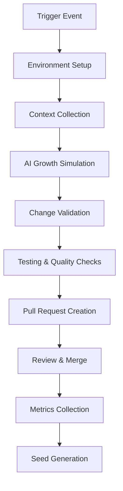

<!--
@file .github/workflows/README.md
@description GitHub Actions workflows documentation for AI Evolution Engine
@author AI Evolution Engine Team <team@ai-evolution-engine.org>
@created 2025-07-05
@lastModified 2025-07-12
@version 0.4.6

@relatedIssues 
  - #workflow-optimization: Continuous improvement of CI/CD workflows
  - #evolution-automation: Automated evolution cycle management

@relatedEvolutions
  - v0.4.6: Cleaned workflow structure and optimized core evolution workflows
  - v0.4.1: Enhanced evolution workflow system with multiple growth modes
  - v0.3.6: Cross-platform compatibility and containerization support

@dependencies
  - GitHub Actions: workflow execution platform
  - bash: >=4.0 for script execution
  - gh CLI: for workflow management and authentication

@changelog
  - 2025-07-12: Added comprehensive file header and enhanced documentation - AEE
  - 2025-07-05: Cleaned workflow structure and removed duplicate files - AEE
  - 2025-07-04: Enhanced workflow system with multiple growth modes - AEE
  - 2025-07-01: Initial creation of comprehensive workflow documentation - AEE

@usage Reference documentation for GitHub Actions workflows and CI/CD automation
@notes Contains documentation for core evolution workflows and automation systems
-->

# AI Evolution Engine - GitHub Actions Workflows (v0.4.6)

This directory contains the GitHub Actions workflows that power the AI Evolution Engine, enabling automated and manual evolution of the codebase through AI-driven growth cycles.

## 🧹 Cleaned Workflow Structure

As of v0.4.6, the workflow structure has been cleaned and optimized:

### ✅ Active Workflows
- `ai_evolver.yml` - Main manual evolution engine
- `daily_evolution.yml` - Automated daily maintenance  
- `periodic_evolution.yml` - Scheduled periodic evolutions
- `testing_automation_evolver.yml` - Testing and build automation

### 🗑️ Removed Files
- `ai_evolver_fixed.yml` (duplicate - merged into main)
- `ai_evolver_v0.4.6.yml` (temporary - merged into main)

## Workflow Overview

### 🌱 Core Evolution Workflows

#### 1. `ai_evolver.yml` - Manual Evolution Engine
**Purpose**: Primary workflow for manual AI-driven evolution triggered by human prompts

**Triggers**: 
- Manual dispatch with custom growth instructions

**Key Features**:
- Custom evolution prompts
- Multiple growth modes (conservative, adaptive, experimental)
- Dry run capability for safe testing
- Automatic seed planting for continuous evolution
- Pull request generation with detailed changes

**Usage**:
```bash
# Trigger manual evolution
gh workflow run ai_evolver.yml \
  -f prompt="Implement user authentication system" \
  -f growth_mode="adaptive" \
  -f dry_run=false
```

#### 2. `daily_evolution.yml` - Automated Maintenance
**Purpose**: Scheduled daily evolution for repository health and maintenance

**Triggers**:
- Daily at 3 AM UTC (scheduled)
- Manual dispatch for immediate health checks

**Key Features**:
- Repository health analysis
- Automatic issue detection and resolution
- Multiple evolution types (consistency, error_fixing, documentation, etc.)
- Intensity levels for controlled growth
- Smart evolution triggering (only when needed)

**Usage**:
```bash
# Force manual daily evolution
gh workflow run daily_evolution.yml \
  -f evolution_type="consistency" \
  -f intensity="moderate" \
  -f force_run=true
```

#### 3. `testing_automation_evolver.yml` - Testing & Build Optimization
**Purpose**: Specialized evolution focused on testing, build processes, and CI/CD improvements

**Triggers**:
- Manual dispatch for testing improvements

**Key Features**:
- Specialized growth modes for testing and builds
- Integration with zer0-mistakes error resolution patterns
- Configurable cycle and generation tracking
- Automated testing validation

**Usage**:
```bash
# Trigger testing evolution
gh workflow run testing_automation_evolver.yml \
  -f growth_mode="test-automation" \
  -f cycle="3" \
  -f generation="1"
```

## Evolution System Architecture

### 🧬 Growth Cycle Process

1. **Environment Preparation**: Setup repository and dependencies
2. **Context Collection**: Gather repository DNA and current state
3. **AI Growth Simulation**: Generate evolution strategy and changes
4. **Change Application**: Apply modifications to codebase
5. **Seed Planting**: Generate next evolution seeds
6. **Validation & Testing**: Ensure changes work correctly
7. **Pull Request Creation**: Submit changes for review

### 🌿 Growth Modes

| Mode | Description | Risk Level | Use Case |
|------|-------------|------------|----------|
| `conservative` | Safe, minimal changes | Low | Production systems, critical fixes |
| `adaptive` | Balanced improvements | Medium | General development, feature additions |
| `experimental` | Advanced features | High | Research, prototype development |
| `test-automation` | Testing focus | Low-Medium | Quality improvements |
| `build-optimization` | CI/CD focus | Medium | Performance improvements |
| `error-resilience` | Error handling | Low | Stability improvements |
| `ci-cd-enhancement` | Pipeline focus | Medium | DevOps improvements |

### 🔧 Supporting Scripts

All workflows utilize modular scripts in the `/scripts` directory:

- `setup-environment.sh`: Environment preparation and validation
- `collect-context.sh`: Repository analysis and context gathering
- `simulate-ai-growth.sh`: AI evolution simulation engine
- `apply-growth-changes.sh`: Change application and validation
- `plant-new-seeds.sh`: Next evolution seed generation
- `create_pr.sh`: Pull request creation and formatting
- `analyze-repository-health.sh`: Health assessment for daily evolution
- `test-evolved-seed.sh`: Evolution validation and testing

## Configuration Standards

All workflows follow consistent patterns defined in `WORKFLOW_STANDARDS.md`:

- **Permissions**: `contents: write`, `pull-requests: write`, `issues: write`
- **Token Usage**: Prefer `GITHUB_TOKEN` over custom PAT tokens
- **Error Handling**: Robust validation and meaningful error messages
- **Dry Run Support**: Safe testing mode for all evolution operations
- **Environment Variables**: Consistent naming and scoping
- **Script Execution**: Proper permissions and error handling

## Evolution Tracking

### Version Management
- Current system version: **v0.4.6**
- Version consistency across all workflows
- Enhanced compatibility and error handling
- Breaking change documentation

### Metrics Collection
- Evolution success rates
- Change impact analysis
- Repository health trends
- Performance metrics

## Security Considerations

### Token Management
- Use minimal required permissions
- Secure handling of sensitive data
- Audit trail for all changes

### Change Validation
- Mandatory dry run testing
- Pull request review process
- Automated validation checks
- Rollback procedures

## Troubleshooting

### Common Issues

1. **Script Not Found**: Ensure all scripts in `/scripts` directory are executable
2. **Permission Denied**: Check repository permissions and token scope
3. **Evolution Failed**: Review logs and use dry run mode for debugging
4. **Missing Dependencies**: Verify setup script execution

### Debug Mode
Enable verbose logging by setting environment variables in workflow dispatch:
```yaml
env:
  DEBUG: true
  VERBOSE: true
```

## Contributing

### Adding New Workflows
1. Follow patterns in `WORKFLOW_STANDARDS.md`
2. Include dry run support
3. Add comprehensive error handling
4. Update this README
5. Test thoroughly before merging

### Modifying Existing Workflows
1. Maintain backward compatibility
2. Update version numbers
3. Document breaking changes
4. Test all evolution modes

## Future Enhancements

- [ ] **Multi-repository evolution support**
- [ ] **Advanced AI model integration**
- [ ] **Real-time evolution monitoring**
- [ ] **Custom evolution templates**
- [ ] **Integration with external tools**
- [ ] **Performance optimization**
- [ ] **Enhanced security features**
- [ ] **Workflow Analytics Dashboard**: Real-time monitoring and metrics visualization
- [ ] **Smart Scheduling**: AI-powered workflow scheduling based on repository activity
- [ ] **Rollback Automation**: Automated rollback capabilities for failed evolution cycles
- [ ] **Cross-Repository Coordination**: Coordinated evolution across multiple repositories
- [ ] **Custom Validation Gates**: Configurable quality gates for evolution approval

## Workflow Examples

### Common Evolution Scenarios

**Feature Development:**
```bash
# Add new feature with comprehensive testing
gh workflow run ai_evolver.yml \
  -f prompt="Add user authentication with JWT tokens, including unit tests and documentation" \
  -f growth_mode="adaptive" \
  -f dry_run=false
```

**Bug Fixes:**
```bash
# Conservative bug fix approach
gh workflow run ai_evolver.yml \
  -f prompt="Fix memory leak in data processing module" \
  -f growth_mode="conservative" \
  -f dry_run=true
```

**Performance Optimization:**
```bash
# Experimental performance improvements
gh workflow run daily_evolution.yml \
  -f evolution_type="performance_optimization" \
  -f intensity="moderate" \
  -f force_run=true
```

### Advanced Workflow Management

**Workflow Status Monitoring:**
```bash
# Check workflow status
gh run list --workflow=ai_evolver.yml --limit=5

# View detailed workflow logs
gh run view <run-id> --log

# Download workflow artifacts
gh run download <run-id>
```

**Workflow Debugging:**
```bash
# Enable debug mode
gh workflow run ai_evolver.yml \
  -f prompt="Debug test failures" \
  -f growth_mode="conservative" \
  -f debug_mode=true
```

## Integration Points

### External System Integration

**Monitoring Systems:**
- **GitHub Actions**: Native integration with GitHub's workflow system
- **Slack/Teams**: Notification webhooks for evolution completion
- **Email Alerts**: Automated notifications for critical evolution events
- **External APIs**: Integration with project management and monitoring tools

**Quality Gates:**
- **Code Quality**: SonarQube, CodeClimate integration
- **Security Scanning**: Snyk, GitHub Security integration
- **Performance Testing**: Integration with performance monitoring tools
- **Compliance**: Automated compliance checking and reporting

## Workflow Architecture

### Evolution Workflow Lifecycle



### Workflow Dependencies

**Required Services:**
- GitHub Actions runner environment
- AI simulation engine
- Git version control system
- Pull request management
- Artifact storage system

**Optional Integrations:**
- Container runtime for isolated execution
- External AI services for enhanced capabilities
- Monitoring and alerting systems
- Quality gate integrations

## Related Documentation

- [Main Repository README](../../README.md) - Project overview and workflow quick start
- [Evolution Engine Documentation](../../docs/evolution/) - Detailed evolution cycle information
- [Daily Evolution Guide](../../docs/evolution/DAILY_EVOLUTION.md) - Automated maintenance workflows
- [Cross-Platform Setup](../../docs/evolution/CROSS_PLATFORM_UPDATE.md) - Platform compatibility guide
- [Testing Framework](../../tests/README.md) - Quality assurance and validation
- [Troubleshooting Guide](../../docs/guides/troubleshooting.md) - Common workflow issues and solutions

---

*This AI Evolution Engine enables continuous improvement through intelligent automation while maintaining human oversight and control.*
