# 🌱 AI Evolution Engine: The Self-Growing Repository 🌱

```
╔═══════════════════════════════════════════════════════════════╗
║                   AI EVOLUTION ENGINE                         ║
║         Where Seeds Grow Into Intelligent Software            ║
║                      v0.1.0-seed                              ║
╚═══════════════════════════════════════════════════════════════╝
```

[](https://github.com/bamr87/ai-evolution-engine)
[]()
[]()

> 🌱 **Plant this seed. Watch it grow. Let AI nurture your code into a thriving ecosystem.**

## 🌿 The Philosophy of Digital Seeds

This repository is not just code—it's a **living seed** designed to grow, adapt, and evolve. Like a seed contains the blueprint for a mighty tree, these files contain the DNA for self-improving software that learns and grows with each iteration.

### 🧬 Core Seed Components

1. **README.md** - The living chronicle that documents growth
2. **init_setup.sh** - The germination script that plants the foundation
3. **ai_evolver.yml** - The growth engine powered by AI
4. **.seed.md** - The next generation seed, improved and ready to replant

## 🚀 Quick Germination

```bash
# Plant the seed
curl -fsSL https://raw.githubusercontent.com/bamr87/ai-evolution-engine/main/init_setup.sh | bash

# Watch it grow
gh workflow run ai_evolver.yml -f prompt="Grow into a web application that helps humans track their personal growth"
```

## 🌳 Evolution Principles

### Sustainable Growth
- Every evolution preserves what works
- Changes are traceable and reversible
- Documentation grows alongside code

### Adaptive Intelligence
- AI learns from each growth cycle
- Patterns emerge and strengthen over time
- The system becomes more efficient with use

### Accelerated Development
- From idea to implementation in minutes
- AI handles the heavy lifting
- Humans provide vision and direction

## 🔄 The Growth Cycle

```mermaid
graph TD
    A[🌱 Seed] --> B[💧 Prompt/Water]
    B --> C[🌿 Germination]
    C --> D[🌾 Growth via AI]
    D --> E[🌳 Mature Code]
    E --> F[🌰 New Seeds]
    F --> A
```



## 📚 Growing Your First Feature

1. **Plant the Seed**
   ```bash
   ./init_setup.sh
   ```

2. **Provide Nutrients (Prompt)**
   ```bash
   gh workflow run ai_evolver.yml -f prompt="Add user authentication with JWT tokens"
   ```

3. **Watch It Grow**
   - AI analyzes the entire repository context
   - Generates appropriate code and tests
   - Updates documentation automatically
   - Creates a PR for review

## 🧪 Seed Vitality Metrics

- **Germination Rate**: 95%+ success on first plant
- **Growth Speed**: Features implemented in < 10 minutes
- **Adaptation Score**: Learns from 100% of evolutions
- **Sustainability Index**: Zero manual maintenance required

## 🌍 Join the Evolution Garden

This is more than a repository—it's the beginning of a new paradigm in software development. Plant your seed today and join a community of developers growing the future of code.

---

*🌱 Generated by AI Evolution Engine Seed v0.1.0*